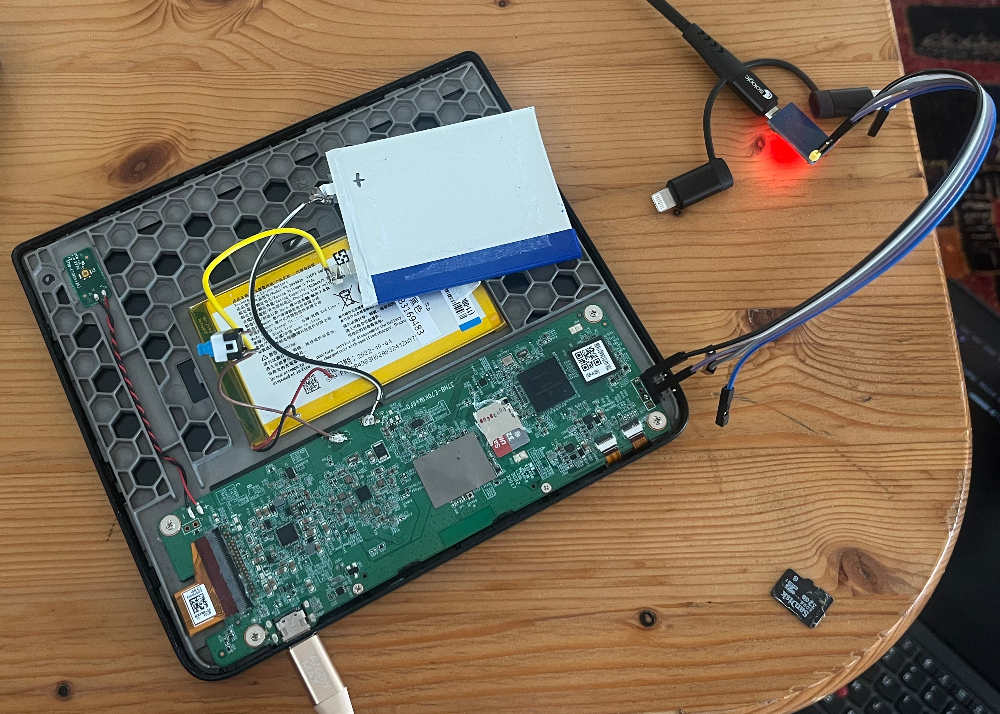

## The patient 
The patient is **Kobo Libre 2**, an monochrome e-ink e-book reader from Kobo, Rakuten.
A friend asked me to rapair it.
### The symptops
`when`: plugged to USB charger or the power button is pressed

`do`: the device blinks the screen with a full refresh (black flash) and then a small white LED on the front panel start to blink indefinietly.
Upon holding the power button (rear) for some 10 sec. the LED stops to blink.

So this made me think that it fails at an early stage, anywhere from bootloader to early OS boot (screen not initialized yet).

### Diagnosis
I pry-opened the device. It's quite funny inside: a metalic frame with a small battery in the middle. I guess a bigger battery is not needed and would make the reader heavier.
_But what is there in the middle of the PCB_ ?? Apparently the device runs off of an microSD card. If you have ever played with a Raspberry Pi, you know that microSD used to be very bad to run a Linux from. These days they come in A2 and what-a-not IOPS ratings, but still.

Searching the internet, there are already helpful and more detailed write-ups on this very problem [(sources)](#sources)


The only thing I missed is documenting the serial wiring, so here it is:
I soldered 2.54mm 4 pin connector to the pins in the corner.

("pin 4" is closest to the edge and next to a screw)

|pin 1|pin 2|pin 3|pin 4|
|:-:|:-:|:-:|:-:|
|GND|Kobo Rx |Kobo Tx |Vcc |
|Black|–|Purple|–|



So what happened is that the SD card failed, and the device could not boot (detailed logs below)
```
...
Buffer I/O error on dev mmcblk0p1, logical block 369, lost async page write
...
mmcblk0: card_busy_detect: error sending status cmd, status 0x80900
EXT4-fs (mmcblk0p1): error loading journal
Kernel panic - not syncing: VFS: Unable to mount root fs on unknown-block(179,1)
---[ end Kernel panic - not syncing: VFS: Unable to mount root fs on unknown-block(179,1)
```

`dd` of this card onto a new one proved to be sufficient. The device booted exactly where it left of, being in the middle of a book! Solved

### Details on the file system
There are 3 partitions, `fdisk` dump:

```
Disk ./microSD_kobo32.img: 29.72 GiB, 31914983424 bytes, 62333952 sectors
Units: sectors of 1 * 512 = 512 bytes
Sector size (logical/physical): 512 bytes / 512 bytes
I/O size (minimum/optimal): 512 bytes / 512 bytes
Disklabel type: dos
Disk identifier: 0x39183845

Device                Boot   Start      End  Sectors  Size Id Type       | Mounts as
./microSD_kobo32.img1        49152   573440   524289  256M 83 Linux      | rootfs
./microSD_kobo32.img2       573441  1359873   786433  384M 83 Linux      | recoveryfs
./microSD_kobo32.img3      1359874 62301182 60941309 29.1G  b W95 FAT32  | KOBOeReader
```

The FAT `KOBOeReader` partition is just storage for user's books, so its size is not crucial. This way you could also expand your storage by just migrating to a bigger SD card. This should also alleviate your current SD card failing..

Reading [\<sources\>](#sources) I learned that there is a recovery image of the rootfs.
If your SD card failed completly (no read-out) or don't have a card at all, here is your minimum setup:
- recovery fs archive
- partitioning info
- serial number

Partition your new, empty SD card according to above table, extract the recovery archive as onto `rootfs` partition and update the serial number in the memory blocks of the SD card (see sources).

---

## Boot Logs
### Booting with battery not connected

```
U-Boot 2016.03-00128-gb3c2551794 (Nov 11 2022 - 15:50:26 +0800)

CPU:   Freescale i.MX6SLL rev1.1 996 MHz (running at 792 MHz)
CPU:   Commercial temperature grade (0C to 95C) at 41C
Reset cause: POR
Board: MX6SLL LPDDR2 NTX
I2C:   ready
DRAM:  512 MiB
__get_sd_number(),cfg23=1,cfg24=0 
MMC:   board_mmc_init() : isd=1 
board_mmc_init() : wifi=2 
FSL_SDHC: 0, FSL_SDHC: 1
In:    serial
Out:   serial
Err:   serial
ntx_hw_early_init() 0
ram p=80000000,size=536870912
switch to partitions #0, OK
mmc0 is current device
mmc read 0x9ffffe00 0x3ff 0x1

MMC read: dev # 0, block # 1023, count 1 ... 1 blocks read: OK
mmc read 0x9ffffe00 0x400 0x1

MMC read: dev # 0, block # 1024, count 1 ... 1 blocks read: OK
ntx_hw_early_init() BD71828 INIT
BD71828_regulator_init
BD71828 RESETSRC [0x3]=0x10
BD71828 KEYSTATUS [0xe2]=0x0
BD71828 BOOTSRC [0x2]=0x2
BD71828 read battery capacity 000, 8,1545
ntx_hw_late_init()
mmc read 0x9ffffc00 0x1 0x1

MMC read: dev # 0, block # 1, count 1 ... 1 blocks read: OK
NTXSN not avalible !
ntx_gpio_get_value(406) : error parameter ! null ptr !
ntx_config_fastboot_layout():11 binaries partition added
ntx_config_fastboot_layout():3 mbr partition added
check_and_clean: reg 0, flag_set 0
Fastboot: Normal
Net:   CPU Net Initialization Failed
No ethernet found.
Hit any key to stop autoboot:  0 
switch to partitions #0, OK
mmc0 is current device
mmc read 0x80800000 0x800 0x2c00

MMC read: dev # 0, block # 2048, count 11264 ... 11264 blocks read: OK
Booting from mmc ...
mmc read 0x83000000 0x505 0x1

MMC read: dev # 0, block # 1285, count 1 ... 1 blocks read: OK
dtb size = 36826@83000000
mmc read 0x83000000 0x506 0x4d

MMC read: dev # 0, block # 1286, count 77 ... 77 blocks read: OK

 hwcfgp=9ffffe00,pcb=101,customer=9

ntx_gpio_get_value(406) : error parameter ! null ptr !
ESDin=0,UPGKey=0,PWRKey=0,USBin=0x1,BootESD=0,MenuKey=0
mmc read 0x9ffffc00 0x37ff 0x1

MMC read: dev # 0, block # 14335, count 1 ... 1 blocks read: OK
mmc read 0x9fdf8800 0x3800 0x103b

MMC read: dev # 0, block # 14336, count 4155 ... 4155 blocks read: OK
mmc read 0x9fdf8600 0x405 0x1

MMC read: dev # 0, block # 1029, count 1 ... 1 blocks read: OK
[WARNING] Binaries load sequence should Lo->Hi !
mmc read 0x9fdf5a00 0x406 0x17

MMC read: dev # 0, block # 1030, count 23 ... 23 blocks read: OK
Kernel RAM visiable size=509M->509M
hwcfg rootfstype : 2
hwcfg partition type : 2,bootmode=0
imx2_watchdog() : WCR=0x39
imx2_watchdog() : enable watchdog,timeout 30 secs,WCR=0x3b35
ntx_prebootm : cmd=setenv bootargs ${bootargs}  hwcfg_p=0x9ffffe00 hwcfg_sz=110 waveform_p=0x9fdf8800 waveform_sz=2126905 ntxfw_p=0x9fdf5a00 ntxfw_sz=11674 mem=509M boot_port=1 rootfstype=ext4 root=/dev/mmcblk0p1 quiet
Kernel image @ 0x80800000 [ 0x000000 - 0x4bdae8 ]
## Flattened Device Tree blob at 83000000
   Booting using the fdt blob at 0x83000000
   Using Device Tree in place at 83000000, end 8300bfd9

...

bd71827-power bd71827-power: Current second 946684899
bd71827-power bd71827-power: Last power off second 943920000
bd71827-power bd71827-power: Check Relax voltage
bd71827-power bd71827-power: bd71827_init_hardware() coulomb_cnt = 589696
bd71827-power bd71827-power: VM_OCV_3 = 1789000
bd71827-power bd71827-power: bd71827_init_hardware() sorg = 0, soc_cal = -5, voltage 1789000, soc 0, charge 2, dc 1
bd71827-power bd71827-power: bd71827_init_hardware() low battery reset_for_manual_Calibration
bd71827-power bd71827-power: VM_OCV_3 = 1789000
bd71827-power bd71827-power: ocv 1789000
bd71827-power bd71827-power: soc -50[0.1%]
bd71827-power bd71827-power: calibration_coulomb_counter() CC_CCNTD = 589824
bd71827-power bd71827-power: bd71827_init_hardware() CC_CCNTD = 589824
bd71827-power bd71827-power: bd71827_init_hardware() pwr->soc = 0
bd71827-power bd71827-power: bd71827_init_hardware() pwr->clamp_soc = 0
jd9930-pmic jd9930-pmic: request powerup gpio failed (-16)!
=== fts_ts_init_2201 ===
elan_ktf 1-0010: [elan] enter elants_i2c_probe..0823_1..
kx122 0-001e: Unable to read property x-map. Use default 0.
kx122 0-001e: Unable to read property y-map. Use default 1.
kx122 0-001e: Unable to read property z-map. Use default 2.
kx122 0-001e: Unable to read property y-negate. Use default 0.
kx122 0-001e: Unable to read property z-negate. Use default 0.
kx122 0-001e: Unable to read property g-range. Use default 8g
kx122 0-001e: Failed to look up default state
[kx122_probe_2674] irq1:121 , gpio1:91 
[kx122_probe_2715] using irq1:121  
[kx122_probe_2747] g_range:8 
[kx122_probe_2780] using irq 
[kx122-CNTL1]:1 
[kx122-CNTL2]:3f 
[kx122-CNTL3]:98 
[KX122_TILT_ANGLE_LL]:11 
[kx122_probe_2827] success 
[P15USB30216C_probe_808] irq:176 
[P15USB30216C_probe_828] Set Reg: 0x46 
[P15USB30216C] set reg  0x46 failed !!!
syscon-poweroff 20cc000.snvs:snvs-poweroff: pm_power_off already claimed 80021adc ntx_machine_poweroff
cpu cpu0: dev_pm_opp_get_opp_count: device OPP not found (-19)
␀␀␀␀␀�␂␀␀␀␀␀
```

### Booting, SD card with (write) problems
```
Starting kernel ...

AW99703 TotalColors:11 , items:12 
jd9930 1-0018: no epdc pmic xon ctrl pin available
dt_get_rsens() RSENS dts property 27000000
bd71827-power bd71827-power: Power-on-reset off
bd71827-power bd71827-power: bd71827_init_hardware() battery through_voltage = 3392000
bd71827-power bd71827-power: Temperature = 27
bd71827-power bd71827-power: Current second 946684851
bd71827-power bd71827-power: Last power off second 943920000
bd71827-power bd71827-power: Check Relax voltage
bd71827-power bd71827-power: bd71827_init_hardware() coulomb_cnt = 589728
bd71827-power bd71827-power: VM_OCV_3 = 3320000
bd71827-power bd71827-power: bd71827_init_hardware() sorg = 0, soc_cal = -3, voltage 3320000, soc 0, charge 2, dc 1
bd71827-power bd71827-power: bd71827_init_hardware() low battery reset_for_manual_Calibration
bd71827-power bd71827-power: VM_OCV_3 = 3320000
bd71827-power bd71827-power: ocv 3320000
bd71827-power bd71827-power: soc -32[0.1%]
bd71827-power bd71827-power: calibration_coulomb_counter() CC_CCNTD = 589824
bd71827-power bd71827-power: bd71827_init_hardware() CC_CCNTD = 589824
bd71827-power bd71827-power: bd71827_init_hardware() pwr->soc = 0
bd71827-power bd71827-power: bd71827_init_hardware() pwr->clamp_soc = 0
jd9930-pmic jd9930-pmic: request powerup gpio failed (-16)!
=== fts_ts_init_2201 ===
elan_ktf 1-0010: [elan] enter elants_i2c_probe..0823_1..
kx122 0-001e: Unable to read property x-map. Use default 0.
kx122 0-001e: Unable to read property y-map. Use default 1.
kx122 0-001e: Unable to read property z-map. Use default 2.
kx122 0-001e: Unable to read property y-negate. Use default 0.
kx122 0-001e: Unable to read property z-negate. Use default 0.
kx122 0-001e: Unable to read property g-range. Use default 8g
kx122 0-001e: Failed to look up default state
[kx122_probe_2674] irq1:121 , gpio1:91 
[kx122_probe_2715] using irq1:121  
[kx122_probe_2747] g_range:8 
[kx122_probe_2780] using irq 
[kx122-CNTL1]:1 
[kx122-CNTL2]:3f 
[kx122-CNTL3]:98 
[KX122_TILT_ANGLE_LL]:11 
[kx122_probe_2827] success 
[P15USB30216C_probe_808] irq:176 
[P15USB30216C_probe_828] Set Reg: 0x46 
[P15USB30216C] set reg  0x46 failed !!!
syscon-poweroff 20cc000.snvs:snvs-poweroff: pm_power_off already claimed 80021adc ntx_machine_poweroff
cpu cpu0: dev_pm_opp_get_opp_count: device OPP not found (-19)
mmcblk0: card_busy_detect: error sending status cmd, status 0x80900
mmcblk0: card_busy_detect: error sending status cmd, status 0x80900
mmcblk0: card_busy_detect: error sending status cmd, status 0x80900
mmcblk0: card_busy_detect: error sending status cmd, status 0x80900
mmcblk0: card_busy_detect: error sending status cmd, status 0x80900
mmcblk0: card_busy_detect: error sending status cmd, status 0x80900
mmcblk0: card_busy_detect: error sending status cmd, status 0x80900
blk_update_request: I/O error, dev mmcblk0, sector 311382
Buffer I/O error on dev mmcblk0p1, logical block 131115, lost async page write
mmcblk0: card_busy_detect: error sending status cmd, status 0x80900
mmcblk0: card_busy_detect: error sending status cmd, status 0x80900
mmcblk0: card_busy_detect: error sending status cmd, status 0x80900
mmcblk0: card_busy_detect: error sending status cmd, status 0x80900
mmcblk0: card_busy_detect: error sending status cmd, status 0x80900
mmcblk0: card_busy_detect: error sending status cmd, status 0x80900
blk_update_request: I/O error, dev mmcblk0, sector 311482
Buffer I/O error on dev mmcblk0p1, logical block 131165, lost async page write
mmcblk0: card_busy_detect: error sending status cmd, status 0x80900
mmcblk0: card_busy_detect: error sending status cmd, status 0x80900
mmcblk0: card_busy_detect: error sending status cmd, status 0x80900
mmcblk0: card_busy_detect: error sending status cmd, status 0x80900
mmcblk0: card_busy_detect: error sending status cmd, status 0x80900
mmcblk0: card_busy_detect: error sending status cmd, status 0x80900
blk_update_request: I/O error, dev mmcblk0, sector 49154
Buffer I/O error on dev mmcblk0p1, logical block 1, lost async page write
mmcblk0: card_busy_detect: error sending status cmd, status 0x80900
mmcblk0: card_busy_detect: error sending status cmd, status 0x80900
mmcblk0: card_busy_detect: error sending status cmd, status 0x80900
mmcblk0: card_busy_detect: error sending status cmd, status 0x80900
mmcblk0: card_busy_detect: error sending status cmd, status 0x80900
mmcblk0: card_busy_detect: error sending status cmd, status 0x80900
blk_update_request: I/O error, dev mmcblk0, sector 49844
Buffer I/O error on dev mmcblk0p1, logical block 346, lost async page write
mmcblk0: card_busy_detect: error sending status cmd, status 0x80900
mmcblk0: card_busy_detect: error sending status cmd, status 0x80900
mmcblk0: card_busy_detect: error sending status cmd, status 0x80900
mmcblk0: card_busy_detect: error sending status cmd, status 0x80900
mmcblk0: card_busy_detect: error sending status cmd, status 0x80900
mmcblk0: card_busy_detect: error sending status cmd, status 0x80900
blk_update_request: I/O error, dev mmcblk0, sector 49852
Buffer I/O error on dev mmcblk0p1, logical block 350, lost async page write
blk_update_request: I/O error, dev mmcblk0, sector 49854
Buffer I/O error on dev mmcblk0p1, logical block 351, lost async page write
mmcblk0: card_busy_detect: error sending status cmd, status 0x80900
mmcblk0: card_busy_detect: error sending status cmd, status 0x80900
mmcblk0: card_busy_detect: error sending status cmd, status 0x80900
mmcblk0: card_busy_detect: error sending status cmd, status 0x80900
mmcblk0: card_busy_detect: error sending status cmd, status 0x80900
mmcblk0: card_busy_detect: error sending status cmd, status 0x80900
blk_update_request: I/O error, dev mmcblk0, sector 49866
Buffer I/O error on dev mmcblk0p1, logical block 357, lost async page write
mmcblk0: card_busy_detect: error sending status cmd, status 0x80900
mmcblk0: card_busy_detect: error sending status cmd, status 0x80900
mmcblk0: card_busy_detect: error sending status cmd, status 0x80900
mmcblk0: card_busy_detect: error sending status cmd, status 0x80900
mmcblk0: card_busy_detect: error sending status cmd, status 0x80900
mmcblk0: card_busy_detect: error sending status cmd, status 0x80900
blk_update_request: I/O error, dev mmcblk0, sector 49870
Buffer I/O error on dev mmcblk0p1, logical block 359, lost async page write
mmcblk0: card_busy_detect: error sending status cmd, status 0x80900
mmcblk0: card_busy_detect: error sending status cmd, status 0x80900
mmcblk0: card_busy_detect: error sending status cmd, status 0x80900
mmcblk0: card_busy_detect: error sending status cmd, status 0x80900
mmcblk0: card_busy_detect: error sending status cmd, status 0x80900
mmcblk0: card_busy_detect: error sending status cmd, status 0x80900
blk_update_request: I/O error, dev mmcblk0, sector 49882
Buffer I/O error on dev mmcblk0p1, logical block 365, lost async page write
mmcblk0: card_busy_detect: error sending status cmd, status 0x80900
mmcblk0: card_busy_detect: error sending status cmd, status 0x80900
mmcblk0: card_busy_detect: error sending status cmd, status 0x80900
mmcblk0: card_busy_detect: error sending status cmd, status 0x80900
mmcblk0: card_busy_detect: error sending status cmd, status 0x80900
mmcblk0: card_busy_detect: error sending status cmd, status 0x80900
blk_update_request: I/O error, dev mmcblk0, sector 49890
Buffer I/O error on dev mmcblk0p1, logical block 369, lost async page write
mmcblk0: card_busy_detect: error sending status cmd, status 0x80900
mmcblk0: card_busy_detect: error sending status cmd, status 0x80900
mmcblk0: card_busy_detect: error sending status cmd, status 0x80900
mmcblk0: card_busy_detect: error sending status cmd, status 0x80900
mmcblk0: card_busy_detect: error sending status cmd, status 0x80900
mmcblk0: card_busy_detect: error sending status cmd, status 0x80900
mmcblk0: card_busy_detect: error sending status cmd, status 0x80900
mmcblk0: card_busy_detect: error sending status cmd, status 0x80900
mmcblk0: card_busy_detect: error sending status cmd, status 0x80900
mmcblk0: card_busy_detect: error sending status cmd, status 0x80900
mmcblk0: card_busy_detect: error sending status cmd, status 0x80900
mmcblk0: card_busy_detect: error sending status cmd, status 0x80900
mmcblk0: card_busy_detect: error sending status cmd, status 0x80900
mmcblk0: card_busy_detect: error sending status cmd, status 0x80900
mmcblk0: card_busy_detect: error sending status cmd, status 0x80900
mmcblk0: card_busy_detect: error sending status cmd, status 0x80900
mmcblk0: card_busy_detect: error sending status cmd, status 0x80900
mmcblk0: card_busy_detect: error sending status cmd, status 0x80900
mmcblk0: card_busy_detect: error sending status cmd, status 0x80900
mmcblk0: card_busy_detect: error sending status cmd, status 0x80900
mmcblk0: card_busy_detect: error sending status cmd, status 0x80900
mmcblk0: card_busy_detect: error sending status cmd, status 0x80900
mmcblk0: card_busy_detect: error sending status cmd, status 0x80900
mmcblk0: card_busy_detect: error sending status cmd, status 0x80900
mmcblk0: card_busy_detect: error sending status cmd, status 0x80900
mmcblk0: card_busy_detect: error sending status cmd, status 0x80900
mmcblk0: card_busy_detect: error sending status cmd, status 0x80900
mmcblk0: card_busy_detect: error sending status cmd, status 0x80900
mmcblk0: card_busy_detect: error sending status cmd, status 0x80900
mmcblk0: card_busy_detect: error sending status cmd, status 0x80900
mmcblk0: card_busy_detect: error sending status cmd, status 0x80900
mmcblk0: card_busy_detect: error sending status cmd, status 0x80900
mmcblk0: card_busy_detect: error sending status cmd, status 0x80900
mmcblk0: card_busy_detect: error sending status cmd, status 0x80900
mmcblk0: card_busy_detect: error sending status cmd, status 0x80900
mmcblk0: card_busy_detect: error sending status cmd, status 0x80900
mmcblk0: card_busy_detect: error sending status cmd, status 0x80900
mmcblk0: card_busy_detect: error sending status cmd, status 0x80900
mmcblk0: card_busy_detect: error sending status cmd, status 0x80900
mmcblk0: card_busy_detect: error sending status cmd, status 0x80900
mmcblk0: card_busy_detect: error sending status cmd, status 0x80900
mmcblk0: card_busy_detect: error sending status cmd, status 0x80900
mmcblk0: card_busy_detect: error sending status cmd, status 0x80900
mmcblk0: card_busy_detect: error sending status cmd, status 0x80900
mmcblk0: card_busy_detect: error sending status cmd, status 0x80900
mmcblk0: card_busy_detect: error sending status cmd, status 0x80900
mmcblk0: card_busy_detect: error sending status cmd, status 0x80900
mmcblk0: card_busy_detect: error sending status cmd, status 0x80900
EXT4-fs (mmcblk0p1): error loading journal
mmcblk0: card_busy_detect: error sending status cmd, status 0x80900
mmcblk0: card_busy_detect: error sending status cmd, status 0x80900
mmcblk0: card_busy_detect: error sending status cmd, status 0x80900
mmcblk0: card_busy_detect: error sending status cmd, status 0x80900
mmcblk0: card_busy_detect: error sending status cmd, status 0x80900
mmcblk0: card_busy_detect: error sending status cmd, status 0x80900
mmcblk0: card_busy_detect: error sending status cmd, status 0x80900
mmcblk0: card_busy_detect: error sending status cmd, status 0x80900
mmcblk0: card_busy_detect: error sending status cmd, status 0x80900
mmcblk0: card_busy_detect: error sending status cmd, status 0x80900
mmcblk0: card_busy_detect: error sending status cmd, status 0x80900
mmcblk0: card_busy_detect: error sending status cmd, status 0x80900
mmcblk0: card_busy_detect: error sending status cmd, status 0x80900
mmcblk0: card_busy_detect: error sending status cmd, status 0x80900
mmcblk0: card_busy_detect: error sending status cmd, status 0x80900
mmcblk0: card_busy_detect: error sending status cmd, status 0x80900
mmcblk0: card_busy_detect: error sending status cmd, status 0x80900
mmcblk0: card_busy_detect: error sending status cmd, status 0x80900
mmcblk0: card_busy_detect: error sending status cmd, status 0x80900
mmcblk0: card_busy_detect: error sending status cmd, status 0x80900
mmcblk0: card_busy_detect: error sending status cmd, status 0x80900
mmcblk0: card_busy_detect: error sending status cmd, status 0x80900
mmcblk0: card_busy_detect: error sending status cmd, status 0x80900
mmcblk0: card_busy_detect: error sending status cmd, status 0x80900
mmcblk0: card_busy_detect: error sending status cmd, status 0x80900
mmcblk0: card_busy_detect: error sending status cmd, status 0x80900
mmcblk0: card_busy_detect: error sending status cmd, status 0x80900
mmcblk0: card_busy_detect: error sending status cmd, status 0x80900
mmcblk0: card_busy_detect: error sending status cmd, status 0x80900
mmcblk0: card_busy_detect: error sending status cmd, status 0x80900
mmcblk0: card_busy_detect: error sending status cmd, status 0x80900
mmcblk0: card_busy_detect: error sending status cmd, status 0x80900
mmcblk0: card_busy_detect: error sending status cmd, status 0x80900
mmcblk0: card_busy_detect: error sending status cmd, status 0x80900
mmcblk0: card_busy_detect: error sending status cmd, status 0x80900
mmcblk0: card_busy_detect: error sending status cmd, status 0x80900
mmcblk0: card_busy_detect: error sending status cmd, status 0x80900
mmcblk0: card_busy_detect: error sending status cmd, status 0x80900
mmcblk0: card_busy_detect: error sending status cmd, status 0x80900
mmcblk0: card_busy_detect: error sending status cmd, status 0x80900
mmcblk0: card_busy_detect: error sending status cmd, status 0x80900
mmcblk0: card_busy_detect: error sending status cmd, status 0x80900
mmcblk0: card_busy_detect: error sending status cmd, status 0x80900
mmcblk0: card_busy_detect: error sending status cmd, status 0x80900
mmcblk0: card_busy_detect: error sending status cmd, status 0x80900
mmcblk0: card_busy_detect: error sending status cmd, status 0x80900
mmcblk0: card_busy_detect: error sending status cmd, status 0x80900
mmcblk0: card_busy_detect: error sending status cmd, status 0x80900
mmcblk0: card_busy_detect: error sending status cmd, status 0x80900
mmcblk0: card_busy_detect: error sending status cmd, status 0x80900
mmcblk0: card_busy_detect: error sending status cmd, status 0x80900
mmcblk0: card_busy_detect: error sending status cmd, status 0x80900
mmcblk0: card_busy_detect: error sending status cmd, status 0x80900
mmcblk0: card_busy_detect: error sending status cmd, status 0x80900
mmcblk0: card_busy_detect: error sending status cmd, status 0x80900
mmcblk0: card_busy_detect: error sending status cmd, status 0x80900
mmcblk0: card_busy_detect: error sending status cmd, status 0x80900
mmcblk0: card_busy_detect: error sending status cmd, status 0x80900
mmcblk0: card_busy_detect: error sending status cmd, status 0x80900
mmcblk0: card_busy_detect: error sending status cmd, status 0x80900
mmcblk0: card_busy_detect: error sending status cmd, status 0x80900
mmcblk0: card_busy_detect: error sending status cmd, status 0x80900
mmcblk0: card_busy_detect: error sending status cmd, status 0x80900
mmcblk0: card_busy_detect: error sending status cmd, status 0x80900
mmcblk0: card_busy_detect: error sending status cmd, status 0x80900
mmcblk0: card_busy_detect: error sending status cmd, status 0x80900
mmcblk0: card_busy_detect: error sending status cmd, status 0x80900
mmcblk0: card_busy_detect: error sending status cmd, status 0x80900
mmcblk0: card_busy_detect: error sending status cmd, status 0x80900
mmcblk0: card_busy_detect: error sending status cmd, status 0x80900
mmcblk0: card_busy_detect: error sending status cmd, status 0x80900
mmcblk0: card_busy_detect: error sending status cmd, status 0x80900
mmcblk0: card_busy_detect: error sending status cmd, status 0x80900
mmcblk0: card_busy_detect: error sending status cmd, status 0x80900
mmcblk0: card_busy_detect: error sending status cmd, status 0x80900
mmcblk0: card_busy_detect: error sending status cmd, status 0x80900
mmcblk0: card_busy_detect: error sending status cmd, status 0x80900
mmcblk0: card_busy_detect: error sending status cmd, status 0x80900
mmcblk0: card_busy_detect: error sending status cmd, status 0x80900
mmcblk0: card_busy_detect: error sending status cmd, status 0x80900
mmcblk0: card_busy_detect: error sending status cmd, status 0x80900
mmcblk0: card_busy_detect: error sending status cmd, status 0x80900
mmcblk0: card_busy_detect: error sending status cmd, status 0x80900
mmcblk0: card_busy_detect: error sending status cmd, status 0x80900
mmcblk0: card_busy_detect: error sending status cmd, status 0x80900
mmcblk0: card_busy_detect: error sending status cmd, status 0x80900
mmcblk0: card_busy_detect: error sending status cmd, status 0x80900
mmcblk0: card_busy_detect: error sending status cmd, status 0x80900
mmcblk0: card_busy_detect: error sending status cmd, status 0x80900
mmcblk0: card_busy_detect: error sending status cmd, status 0x80900
mmcblk0: card_busy_detect: error sending status cmd, status 0x80900
mmcblk0: card_busy_detect: error sending status cmd, status 0x80900
mmcblk0: card_busy_detect: error sending status cmd, status 0x80900
mmcblk0: card_busy_detect: error sending status cmd, status 0x80900
mmcblk0: card_busy_detect: error sending status cmd, status 0x80900
mmcblk0: card_busy_detect: error sending status cmd, status 0x80900
mmcblk0: card_busy_detect: error sending status cmd, status 0x80900
mmcblk0: card_busy_detect: error sending status cmd, status 0x80900
mmcblk0: card_busy_detect: error sending status cmd, status 0x80900
mmcblk0: card_busy_detect: error sending status cmd, status 0x80900
mmcblk0: card_busy_detect: error sending status cmd, status 0x80900
mmcblk0: card_busy_detect: error sending status cmd, status 0x80900
EXT4-fs (mmcblk0p1): error loading journal
Kernel panic - not syncing: VFS: Unable to mount root fs on unknown-block(179,1)
---[ end Kernel panic - not syncing: VFS: Unable to mount root fs on unknown-block(179,1)
```

### Booting with happy SD card:
```
Starting kernel ...

AW99703 TotalColors:11 , items:12 
jd9930 1-0018: no epdc pmic xon ctrl pin available
dt_get_rsens() RSENS dts property 27000000
bd71827-power bd71827-power: Power-on-reset on
bd71827-power bd71827-power: VM_OCV_0 = 3775000
bd71827-power bd71827-power: VM_OCV_1 = 3775000
bd71827-power bd71827-power: VM_OCV_2 = 3771000
bd71827-power bd71827-power: VM_OCV_3 = 3852000
bd71827-power bd71827-power: ocv 3852000
bd71827-power bd71827-power: soc 558[0.1%]
bd71827-power bd71827-power: calibration_coulomb_counter() CC_CCNTD = 70254592
bd71827-power bd71827-power: bd71827_init_hardware() battery through_voltage = 3392000
bd71827-power bd71827-power: Temperature = 28
bd71827-power bd71827-power: Current second 946684803
bd71827-power bd71827-power: Last power off second 943920000
bd71827-power bd71827-power: Check Relax voltage
bd71827-power bd71827-power: bd71827_init_hardware() coulomb_cnt = 70254592
bd71827-power bd71827-power: bd71827_init_hardware() CC_CCNTD = 70254592
bd71827-power bd71827-power: bd71827_init_hardware() pwr->soc = 56
bd71827-power bd71827-power: bd71827_init_hardware() pwr->clamp_soc = 56
jd9930-pmic jd9930-pmic: request powerup gpio failed (-16)!
=== fts_ts_init_2201 ===
elan_ktf 1-0010: [elan] enter elants_i2c_probe..0823_1..
kx122 0-001e: Unable to read property x-map. Use default 0.
kx122 0-001e: Unable to read property y-map. Use default 1.
kx122 0-001e: Unable to read property z-map. Use default 2.
kx122 0-001e: Unable to read property y-negate. Use default 0.
kx122 0-001e: Unable to read property z-negate. Use default 0.
kx122 0-001e: Unable to read property g-range. Use default 8g
kx122 0-001e: Failed to look up default state
[kx122_probe_2674] irq1:121 , gpio1:91 
[kx122_probe_2715] using irq1:121  
[kx122_probe_2747] g_range:8 
[kx122_probe_2780] using irq 
[kx122-CNTL1]:1 
[kx122-CNTL2]:3f 
[kx122-CNTL3]:98 
[KX122_TILT_ANGLE_LL]:11 
[kx122_probe_2827] success 
[P15USB30216C_probe_808] irq:176 
[P15USB30216C_probe_828] Set Reg: 0x46 
[P15USB30216C] set reg  0x46 failed !!!
syscon-poweroff 20cc000.snvs:snvs-poweroff: pm_power_off already claimed 80021adc ntx_machine_poweroff
cpu cpu0: dev_pm_opp_get_opp_count: device OPP not found (-19)
1+0 records in
1+0 records out
512 bytes (512B) copied, 0.001239 seconds, 403.6KB/s
NtxHwCfg_GetCfgFldStrVal:[WARNING]Config version too old !! Please update config file !!
NtxHwCfg_GetCfgFldStrVal:[WARNING]Config version too old !! Please update config file !!
1+0 records in
1+0 records out
512 bytes (512B) copied, 0.000381 seconds, 1.3MB/s
NtxHwCfg_GetCfgFldStrVal:[WARNING]Config version too old !! Please update config file !!
NtxHwCfg_GetCfgFldStrVal:[WARNING]Config version too old !! Please update config file !!
cannot open /dev/null
bd71827-power bd71827-power: DCIN_STAT CHANGED from 0x0 to 0x1
fsck.fat 4.1+git (2017-01-24)
0x41: Dirty bit is set. Fs was not properly unmounted and some data may be corrupt.
 Automatically removing dirty bit.
Free cluster summary wrong (1876956 vs. really 1876861)
  Auto-correcting.
/dev/mmcblk0p3: 1307 files, 26625/1903486 clusters
fsck.fat 4.1+git (2017-01-24)
/dev/mmcblk0p3: 1307 files, 26625/1903486 clusters
1+0 records in
1+0 records out
512 bytes (512B) copied, 0.000130 seconds, 3.8MB/s
NtxHwCfg_GetCfgFldStrVal:[WARNING]Config version too old !! Please update config file !!
NtxHwCfg_GetCfgFldStrVal:[WARNING]Config version too old !! Please update config file !!
file "/dev/mmcblk0p6" open fail !!
command hwcfg fail !!
sh: ON: unknown operand
rm: can't remove '/mnt/onboard/.kobo/sickel_frozen': No such file or directory

kobo login: /usr/local/Kobo/nickel: /usr/lib/libxml2.so.2: no version information available (required by /usr/local/Kobo/libnickel.so.1)
/usr/local/Kobo/nickel: /usr/lib/libxml2.so.2: no version information available (required by /usr/local/Kobo/libnickel.so.1)
/usr/local/Kobo/nickel: /usr/lib/libxml2.so.2: no version information available (required by /usr/local/Kobo/libnickel.so.1)
/usr/local/Kobo/nickel: /usr/lib/libxml2.so.2: no version information available (required by /usr/local/Kobo/libnickel.so.1)
sh: ON: unknown operand
sh: ON: unknown operand
sh: ON: unknown operand
sh: ON: unknown operand
sh: ON: unknown operand
sh: ON: unknown operand
sh: ON: unknown operand
sh: ON: unknown operand
sh: ON: unknown operand
sh: ON: unknown operand
sh: you need to specify whom to kill
sh: ON: unknown operand
sh: ON: unknown operand
sh: ON: unknown operand
sh: ON: unknown operand
=== kx122_sysfs_set_tilt_angle_ll_1731  11====
sh: ON: unknown operand
sh: ON: unknown operand
sh: ON: unknown operand
sh: ON: unknown operand
sh: ON: unknown operand
sh: ON: unknown operand
sh: ON: unknown operand
killall: wpa_supplicant: no process killed
dhcpcd[1503]: version 6.6.6 starting
dhcpcd[1503]: wlan0: using /sys hwaddr: 58:b0:d4:d4:c3:f9
dhcpcd[1503]: wlan0: executing `/libexec/dhcpcd-run-hooks' PREINIT
dhcpcd[1503]: wlan0: executing `/libexec/dhcpcd-run-hooks' NOCARRIER
dhcpcd[1503]: no interfaces have a carrier
dhcpcd[1503]: forking to background
dhcpcd[1503]: forked to background, child pid 1513
```

## Sources
- [https://libreplanet.org/wiki/Group:Hardware/Computers/e-readers/Kobo/Aura_H2O_Edition_2/boot_log_Bienvenue_sur_Kobo_!](https://libreplanet.org/wiki/Group:Hardware/Computers/e-readers/Kobo/Aura_H2O_Edition_2/boot_log_Bienvenue_sur_Kobo_!)
- https://39labs.org/blog/reviving-a-dead-kobo-libra-2/

