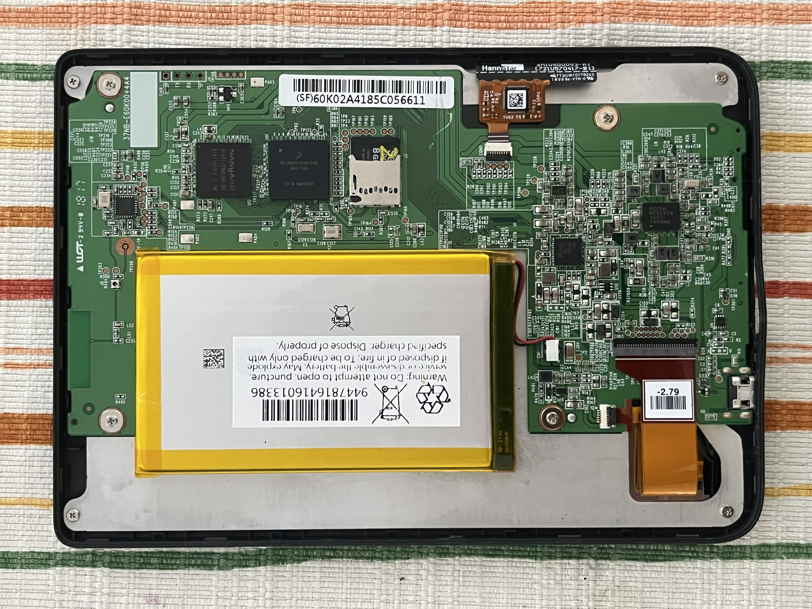

# This time I have..
Another Kobo e-ink reader!
This time someone discarded a **Kobo Clara HD**, an monochrome e-ink e-book reader from Kobo, Rakuten.
A friend gave it me, knowing my previous efforts[link].

It looks all-right on the outside, except for the missing power button. The microUSB port is not damaged.

## Diagnosis
Connecting to a computer yields what we've already seen (before)[link]: nothing happens on the computer (`dmesg -w`) but the device blinks a white LED every second.

Time to open it up and check the SD card.. if there is one inside as well!




So we have a microSD card again! Trying to answer my own question from the aforementioned post:
> Do all Kobo e-book readers have microSD card inside ??

Makes me think that "yes". :)

### internal SD card

This time there is a battery connector, how useful. Remembering from the previous repair, that you need to power-cycle the device to re-read the SD card.

The factory card has this information etched on it:
```
SanDisk EDGE
8GB class 4
microSD HC I
made in China
```

and it is **properly** dead:


`dmesg`:
```
243495.094888] mmc0: Skipping voltage switch
[243495.497760] I/O error, dev mmcblk0, sector 0 op 0x0:(READ) flags 0x0 phys_seg 1 prio class 2
[243495.497783] Buffer I/O error on dev mmcblk0, logical block 0, async page read
[243495.497811] ldm_validate_partition_table(): Disk read failed.
[243495.505904] I/O error, dev mmcblk0, sector 0 op 0x0:(READ) flags 0x0 phys_seg 1 prio class 2
[243495.505925] Buffer I/O error on dev mmcblk0, logical block 0, async page read
[243495.505953]  mmcblk0: unable to read partition table

```

`dd`:
```
dd: error reading '/dev/mmcblk0': Input/output error
0+0 records in
0+0 records out
0 bytes copied, 0.0397663 s, 0.0 kB/s
```

`ddrescue`:
```
Trimming failed blocks... (forwards)          
     ipos:    1799 MB, non-trimmed:    1800 MB,   current rate:       0 B/s
     opos:    1799 MB, non-scraped:        0 B,   average rate:       0 B/s
non-tried:    6147 MB,  bad-sector:     1024 B,     error rate:  16056 kB/s
  rescued:        0 B,   bad areas:          2,       run time:      2m  3s
pct rescued:    0.00%, read errors:     27_562, remaining time:         n/a
                               time since last successful read:         n/a
```

Time to find the image of the system.. Or maybe I can try booting this Kobo with the previous Kobo's OS ??

