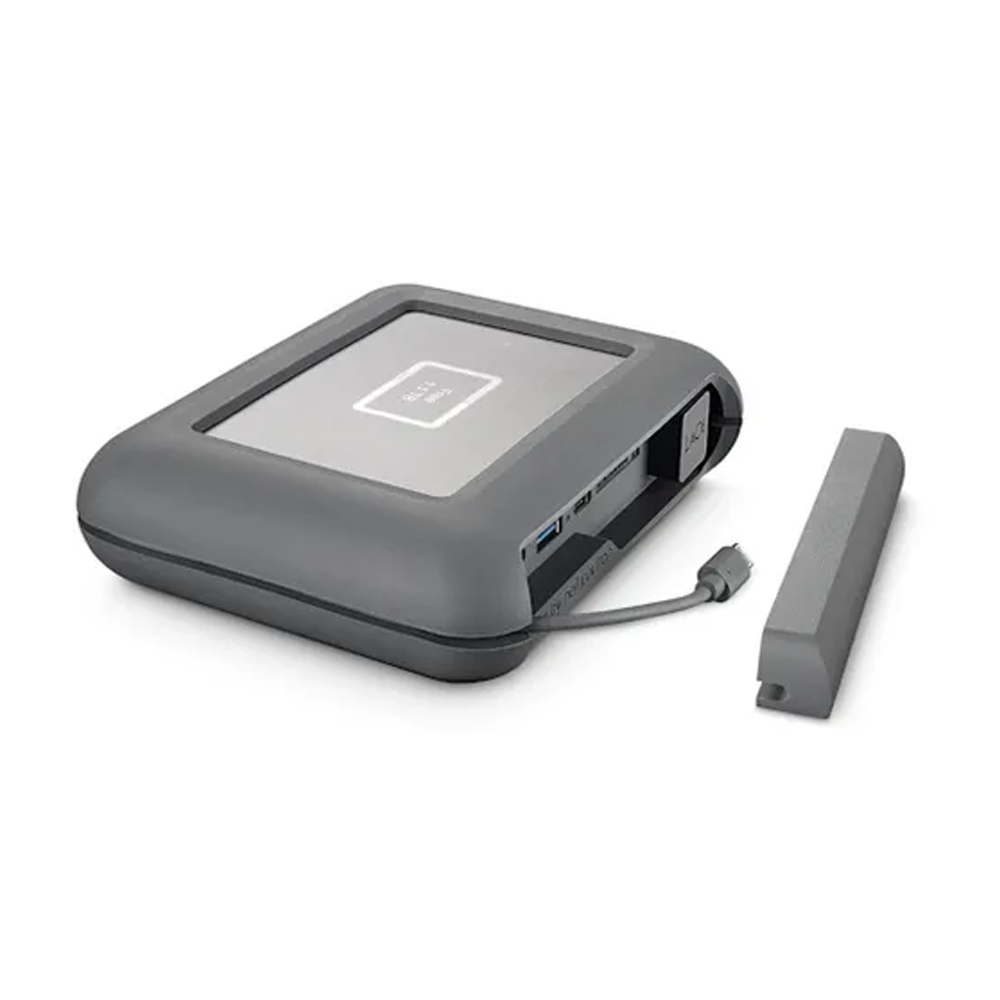
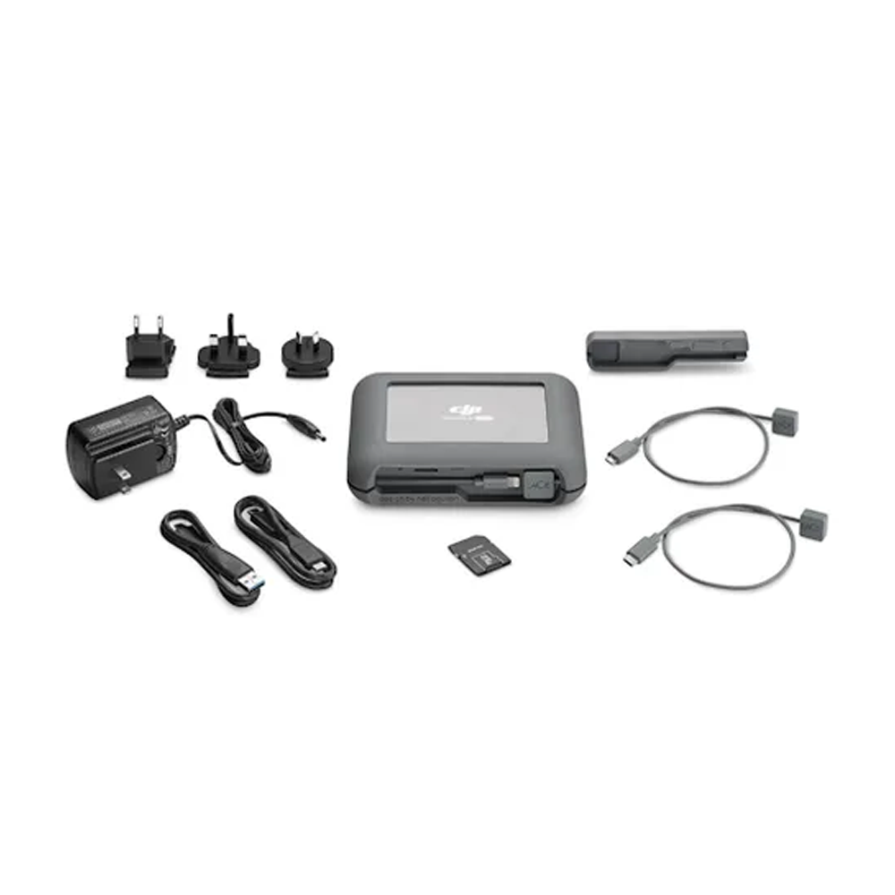
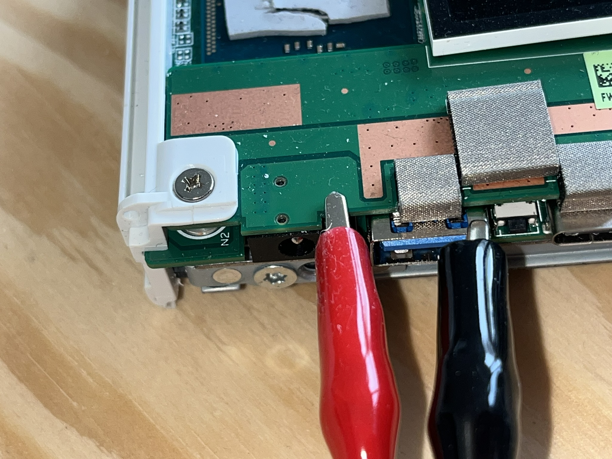
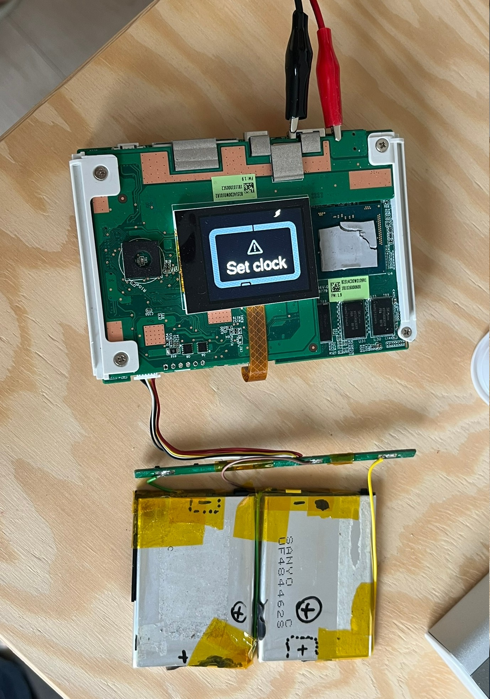
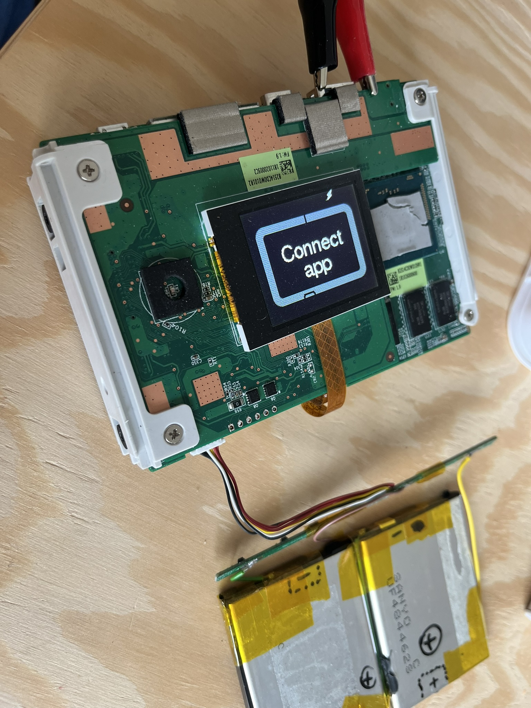
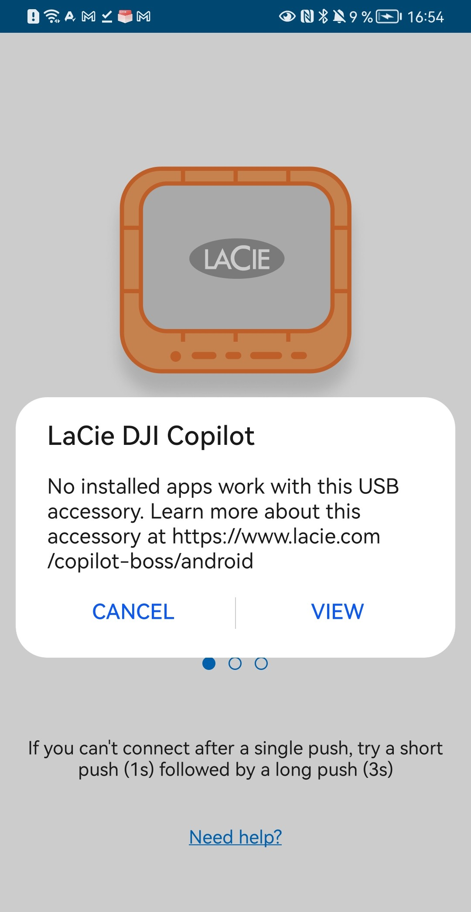
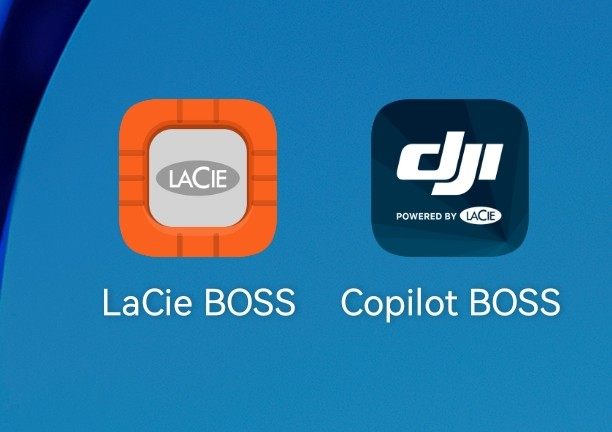
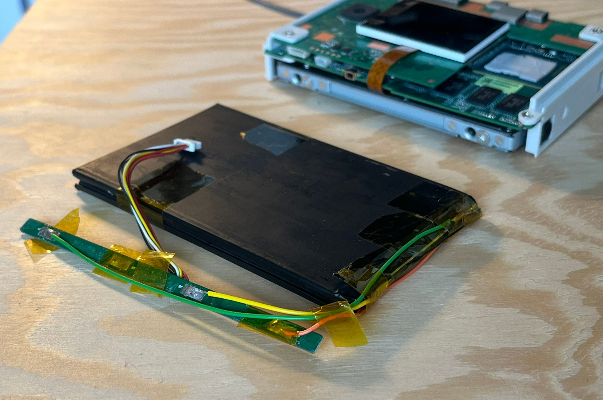
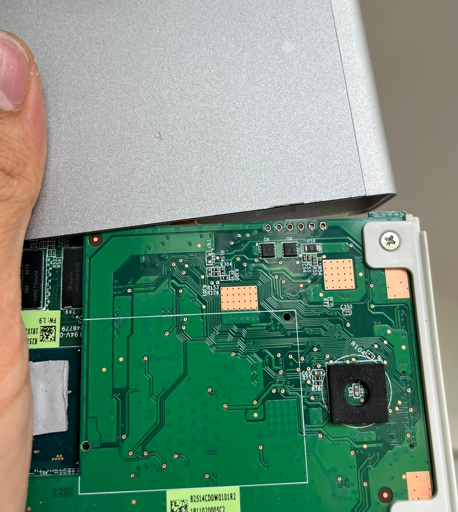
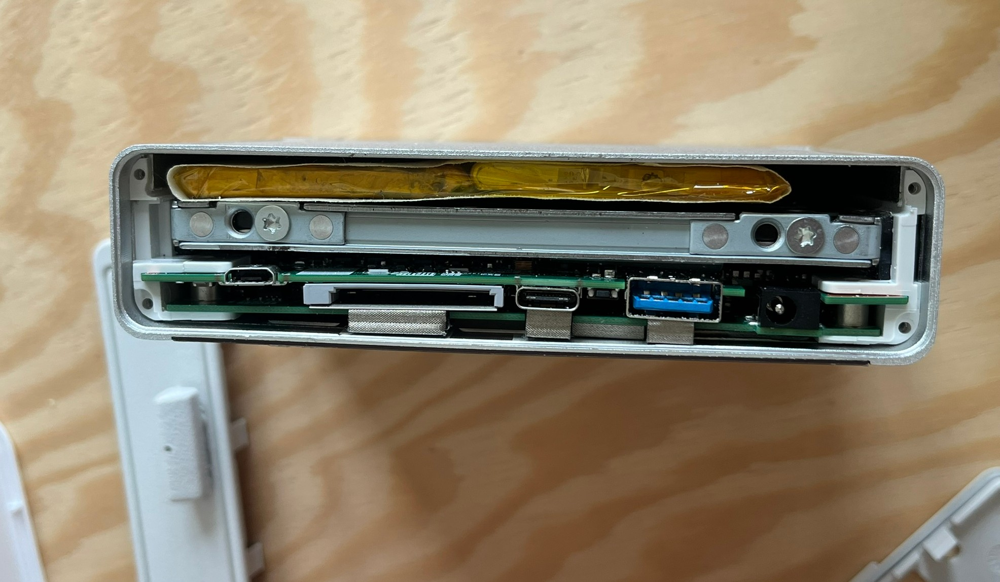

First let me introduce this device here, as it's a pretty much a dead product with not many mentions on the internet:

<div style="display: flex; gap: 10px;">
  
  
</div>

# LaCie DJI Copilot
It is a backup station for content creators made by LaCie and sold around 2018-2021. It was intended for drone footage, but I don't see anything special about it besides "DJI" branding. It has a 2TB hard drive inside. When new, it costed around [350€](https://tweakers.net/pricewatch/1130421/lacie-dji-copilot-boss-2tb-grijs.html) making it quite a premium, niche tool. I have a hunch that it failed commercially.

It is not so easy to understand how to use it. You can try to read [the manual](https://www.seagate.com/content/dam/seagate/migrated-assets/www-content/manuals/lacie.com/pdf/lacie.com-en_GB.pdf), but it helps only a bit.
I think it's a really cool device, that they made, but it's a bit difficult to grasp how to use it.
(It also has a sleep mode, which makes it more complicated)

For me it helps to think of it as a Linux computer with an attached storage and host/device ports.

## Modes
It has many hardware ports and each port is supposed to be used in a given way, otherwise it's "not tested/unsupported". Using given ports is coupled with modes, which there are 3 of, according to me:

### 1.a. Stand-alone
In this mode you can back-up SD card and/or a USB storage onto the internal 2TB drive. It is a full copy, not incremental you can only start it and stop it.

### 1.b. Stand-alone with smartphone
Connecting a smartphone with an app ("LaCie DJI Copilot BOSS") to the microUSB host port allows for more interactive 1.a. You have now more control over back-ups, can manage files and settings. Also in this mode you can back-up your whole LaCie drive onto another 2TB USB disk.

### 2. Connected to a computer via USB device
In this mode a host computer gets an exclusive access to device's hard drive, SD card and USB a port. This mode makes this device still useful, even if battery and app dies – IN THEORY.

## The repair
I found device not working and with just microUSB–iPhone cable included.
The device was totally dead, albeit I didn't have a barrel jack power supply.
I disassembled it and started to poke around:
The hard drive is just a standard SATA 2.5" HDD.
The battery is a 2 cell (7.4V nom.) LiPol battery, and it has failed. One of the pouches was full of gas, so its ESR is likely very high and it does not work. Measured voltage was pretty much 0V.

I fashioned a replacement battery from my stock, but unfortunately it is quite bad as well, so the device browns-out when there is a phone charging off of it.
I soldered the new cells in a 2S arrangement with 3 terminals and reused the original BMS board. It has contacts for B+ (7.4V), 2×BM (3.7V) and B- (0V). 

---
### Battery specification

Factory battery consists of 2 cells rated:
```
Model: L0691-LF  2ICP5/54/69
Rating: 7.7V / 2550mAh / 19.6Wh
Charging Limited Voltage: 8.8V
Manufacturer name: EVE Energy Co., Ltd.
Manufacturing date: 2018.25 Rev E
Country of oriin: China
```
So a single cell is 3.7V 2550mAh


| battery cell dimensions | width [mm] | length | height |
| - | -: | -: | -: |
| factory single cell dimensions | 54.1 | 68.8 | 4.7 |
| maximum 2-cell pack dimensions | ~110  | ~70   | 6.5 |
<div style="text-align: center;">
where <i>width</i> is the dimension of 1 or 2 cells next to each other.
</div>
<br>

I tried to make a battery pack out of MacBook cells, but it just would not fit (height especially). Do not try to fit any bigger there. I stopped when I still could. Forcing a LiPol battery does not feel right, especially that is should have some space to gas up once it fails.. Or shouldn't it?

---

After connecting the battery nothing happened, even when the battery was externally charger (with a lab power supply).

## Powering on
I figured, that the device not only requires a healthy battery to power on, but also after disconnecting the battery it only comes to live when receiving 12V on the barrel jack charging port.

<div style="text-align: center;">

<i>I didn't have a correct power adaptor, so I used aligator clips.<br>The red one holds onto a central pin of the barrel socket</i>
</div>
<br>

Once powered the device **begs for an app like a nestling for food**. You can not go further.


<div style="display: flex; gap: 10px; text-align: center;">


</div>


Now, **this is stupid**. I understand that the device needs an internal clock to be synchronized, but this could still be done with a button, even if just a single one.
I'm actually curious what kind of USB communication happens between LaCie (host) and the mobile device (Android).

# Findings
Looking up the battery model [I found out](https://www.reddit.com/r/batteries/comments/1igy0p0/help_finding_replacement_77v_lion/), that there is actually a bare LaCie (non-DJI) device like this! 

It is called "**LaCie Rugged BOSS SSD**" and it seems to have been way more popular.
<br>Basically my "LaCie DJI Copilot" is "LaCie Rugged BOSS SSD" but in grey, with 2TB HDD and with different start-up logo.
And the apps are bascially the same, but different. They bothered to release 2 apps which differ just in branding. The last released version is `1.00.45.19` for both and this is what I used to "Set The Clock" of the device. You can download the APK [here](files/Copilot_BOSS_01.00.45.19_APKPure.apk).

Also, you can see a lot of details in [this review](https://realhardwarereviews.com/lacie-rugged-boss-ssd-review/3/#split_content). 

## Mode 1.b Cable
Since I couldn't install the magical app on an iPhone I needed a USB C cable for Android phone. By trial and error I discovered that their "custom" cables for mode 1.b. is actually
- microUSB host cable (OTG)
- with device plug on the other end (USB C / microUSB / Lightning)

Once I installed the app and assembled the cable, it worked, though the detection took a while and I needed to accept some Android pop-up about "File Transfer" USB mode.


<div style="text-align: center;">

<i>Trying to use the "LaCie Rugged BOSS" app with the LaCie Copilot DJI device. They must recognize some ID to be "wrong"</i>
</div>
<br>

<div style="text-align: center;">

<i>One app in two different colorways..<br>I wish I had found the orange one</i>
</div>
<br>


## Findings continued (loose):
 - the app cannot be installed on iOS device in 2026 - neither officially nor I could find an .ipa
 - the app can be installed on a Android phone, I provide the APK found on the internet
 - custom proprietary cable for mode 1.b. is actually a microUSB host cable (OTG), with device plug on the other end (USB C, microUSB, Lightning?)
 - it does **not** charge through USB C ([mode 2.](#2.-Connected-to-a-computer-via-USB-device)) when the battery is fully dead
 - barrel jack connector is 2.5×0.8mm, voltage is 12V tip positive
 - when you connect a battery, the device needs to be revived, even if the battery is full by connecting the barrel jack charger
 - I changed the HDD to 500GB and it works fine, the device does not complain

 
#### More pictures
<div style="text-align: center;">

<i>Self-made battery, that turned out to be too big in each dimension</i>
</div>
<br>

<div style="text-align: center;">

<i>When assembling back together, the display cannot be first neat placed in its recesion, because it would knock those Q6 & Q8 transistors out<br>It has to be placed within the white rectangle and slid inside the aluminium shell</i>
</div>
<br>

<div style="text-align: center;">

<i>Side view with the 2nd battery fitting loosely in</i>
</div>

